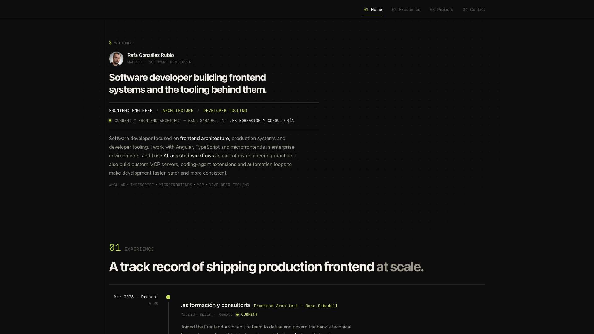

# Personal Portfolio

A minimal personal portfolio built with React and Vite, focused on frontend architecture, production systems and developer tooling.



## Features

- **Responsive Design**: Optimized for desktop and mobile layouts
- **Editorial UI**: Minimal dark interface with timeline-driven experience
- **Modular Architecture**: CSS Modules for scoped component styles
- **Optimized Performance**: Built with Vite

## Tech Stack

- **Frontend**: React 19, JavaScript ES6+
- **Bundler**: Vite 7
- **Styling**: CSS Modules
- **Linting**: ESLint

## Project Structure

```
src/
├── components/     # Reusable components
│   ├── Navbar.jsx
│   └── Separator.jsx
├── sections/       # Main portfolio sections
│   ├── Home.jsx
│   ├── Experience.jsx
│   ├── Projects.jsx
│   └── Contact.jsx
├── layouts/        # Main layout
│   └── MainLayout.jsx
├── styles/         # CSS Modules per component
├── assets/         # Static images and resources
├── constants/      # Configurations and data
└── utils/          # Utility functions
```

## Installation & Usage

### Prerequisites
- Node.js 20 or higher
- npm or yarn

### Installation

```bash
# Clone repository
git clone [repository-url]

# Navigate to directory
cd personal-portfolio

# Install dependencies
npm install

# Start development server
npm run dev
```

### Available Scripts

```bash
npm run dev      # Development server
npm run build    # Production build
npm run preview  # Build preview
npm run lint     # Run ESLint
```

## Portfolio Sections

- **Home**: Personal introduction, profile image and core capabilities
- **Experience**: Professional timeline
- **Projects**: Featured projects with GitHub links and demos
- **Contact**: Contact information and social networks

## Technical Features

- **CSS Modules**: Encapsulated styles
- **Responsive Design**: Desktop, tablet and mobile optimized
- **SEO Friendly**: Meta tags and semantic structure
- **Accessibility**: WCAG compliant

## License

This project is for personal use. Feel free to use it as reference for your own portfolio.

---

Built with React and Vite
